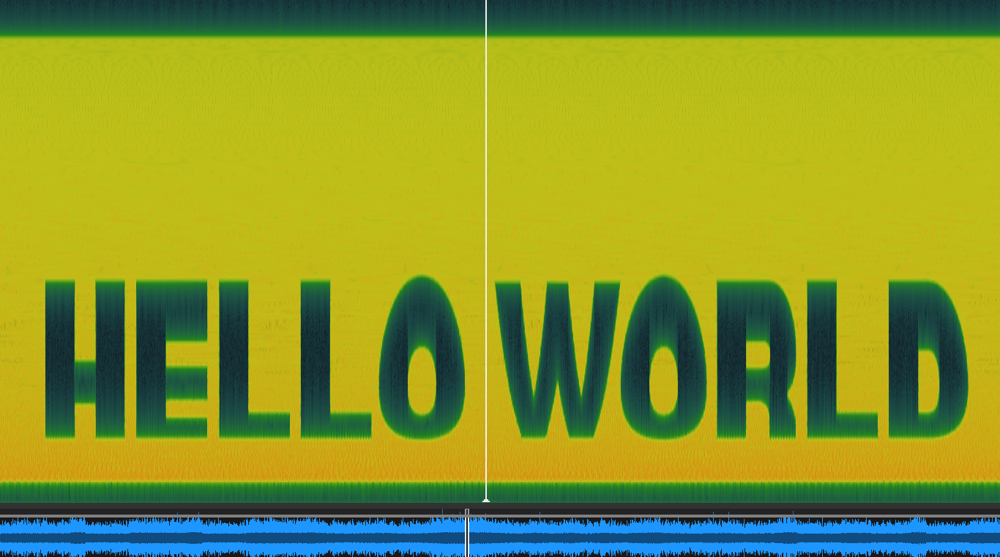

# Spectrogram-Encoder

Convert any image into an audio file where the original image can be seen inside a **spectrogram** of the audio. Great for audio steganography, sonification art, and experimental signal processing.



## Features

- Interactive command-line tool (no flags needed)
- Converts images into spectrogram-audio (WAV)
- Supports grayscale or RGB channel encoding
- Inverts image if needed
- Visualizes spectrogram automatically


## Requirements
```
numpy
pillow
soundfile
matplotlib
scipy
```

## Installation

```bash
git clone https://github.com/joykhaneja/Spectogram-Encoder.git
cd Spectogram-Encoder
pip install -r requirements.txt
```

## Usage

```bash
python3 img2spec.py
```
You’ll be prompted to select:
- Input image
- Duration, frequency range, sample rate
- Channel (grayscale / RGB)
- Whether to invert

## Output

- A .wav audio file containing your image encoded into its spectrogram
- A visual preview of the generated spectrogram
